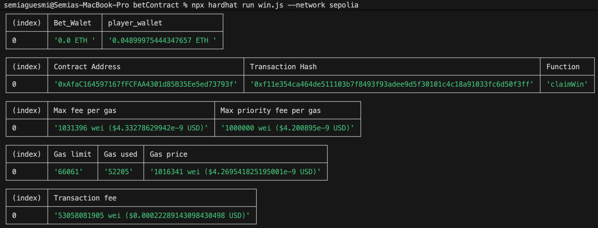
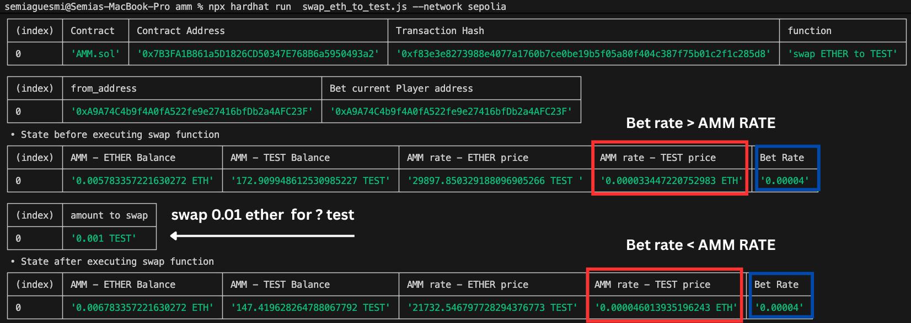
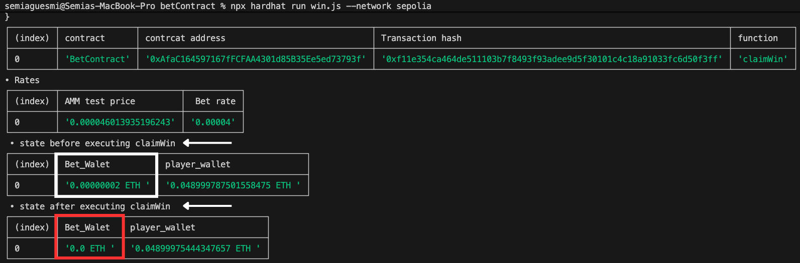
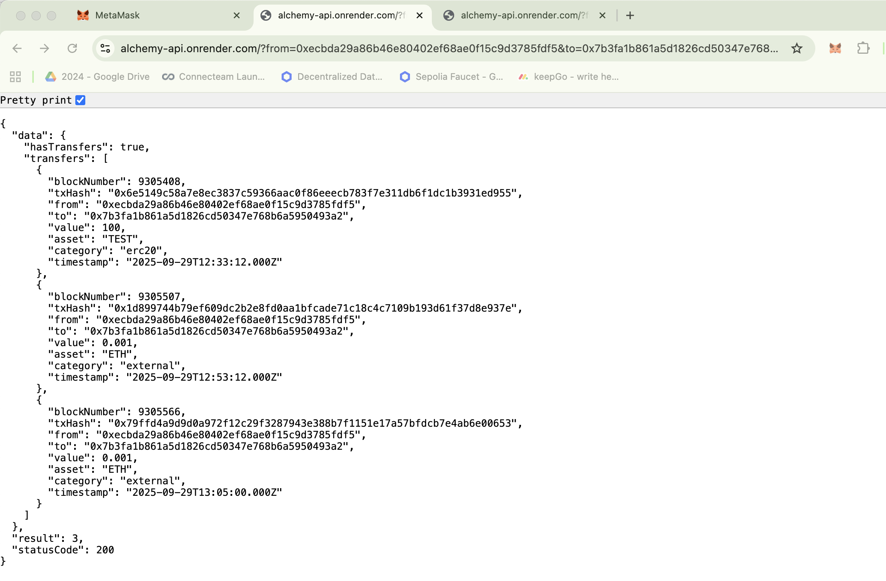

## MEV Simulation (Bet Contract)

This directory contains all files needed to simulate and experience MEV attacks against the betting contract. The simulations are divided into two main scenarios:

- **Scenario 1 — Vulnerable BetContract:** runs the original, vulnerable `BetContract` to reproduce MEV attack behavior.  
- **Scenario 2 — Protected ProtectedBetContract:** runs the `ProtectedBetContract` (extended with an oracle verification layer) to demonstrate mitigation of MEV opportunities.

Each contract function used in the simulations has an associated script that records gas consumption for the executed transaction. The example below shows the script output after invoking the `claimWin` function of the `BetContract` — the image demonstrates the measured gas usage, transaction fee, gas price..etc for that transaction:



---

### ⚠️ Important Notes before running
- **Deployment order matters.** Ensure contracts are deployed in the correct order and that `MEVSimulation/constants.js` is updated with the newly deployed contract addresses after each deployment.  

---

## Scenario 1 — Vulnerable BetContract

**Goal:** reproduce MEV attack steps using the original vulnerable `BetContract`.

**Typical steps:**

1. Place a bet:
 ```bash
npx hardhat run MEVSimulation/betContract/placeBet.js --network sepolia
```
2. Claim a win:

 ```bash
npx hardhat run MEVSimulation/betContract/claimWin.js --network sepolia
```
The success or outcome of claimWin depends on the current price/rate provided by the AMM contract. For a pure “fair execution” run, do not interact with the AMM rate contract between placeBet and claimWin.

---

To simulate an MEV attack that manipulates price, run scripts that modify the AMM state between these steps.

**Typical steps:**

1. Place a bet:
 ```bash
npx hardhat run MEVSimulation/betContract/placeBet.js --network sepolia
```
2. Swap Ether to Test to affect the AMM rate :
 ```bash
npx hardhat run MEVSimulation/AMM/swap_eth_to_test.js --network sepolia
```
***note*** swapping ETH → TEST means you buy TEST with ETH. In a constant-product AMM (K = x * y), this increases the ETH reserve (x) and decreases the TEST reserve (y), which raises the price of TEST relative to ETH (i.e., more ETH per TEST). In this project the BetContract bets on the price of TEST versus ETH — if the AMM price for TEST is higher before the claim deadline, the player may win. To simulate the opposite effect (increasing the ETH price), run the inverse swap script:

 ```bash
npx hardhat run MEVSimulation/AMM/swap_test_to_eth.js --network sepolia
```
3. Claim a win:

 ```bash
npx hardhat run MEVSimulation/betContract/claimWin.js --network sepolia
```
 
In this scenario, the `BetContract` risks losing its entire value because a player can perform a swap on the AMM to manipulate the TEST/ETH price and then claim an unfair win. This swap is effectively a **front-running / price-manipulation attack** — the attacker changes the AMM state to profit at the contract’s expense.

You can also see in the following pictures how the swap operation affects the price in the AMM contract, ultimately causing the `BetContract` to end up with **0 ETH**.




---

## Scenario 2 — Protected BetContract 

We modified the vulnerable `BetContract` by adding a **verification layer** to mitigate MEV attacks and restrict their possibilities. This verification layer relies on a **Chainlink oracle** that queries an [external API](https://github.com/SEMIAGUESMI/alchemyapi.git) to fetch all asset transfer transactions between the player and the rate contract (AMM contract) during the block range between the `placeBet()` call and the `claimWin()` call.  

When the player invokes `claimWin()`, the Chainlink oracle is triggered: it sends an HTTP GET request to the API to check whether the player interacted with the AMM contract within that block interval.  
- If the result shows **0 interactions**, and all other conditions to win are satisfied, the player is allowed to claim the win.  
- If any interactions are detected, the win is rejected as an **MEV attempt**.

**Typical steps:**

1. Place a bet :
 ```bash
npx hardhat run MEVSimulation/protectedBetContract/placeBet.js --network sepolia
```
2. claim a win :
 ```bash
npx hardhat run MEVSimulation/protectedBetContract/claimWin.js --network sepolia
```


---

The following picture shows an example output of a URL request sent by the Chainlink oracle to the external API, listing the transactions between the player and the AMM contract within a specific interval.

URL = https://alchemy-api.onrender.com/?from=0xecbda29a86b46e80402ef68ae0f15c9d3785fdf5&to=0x7b3fa1b861a5d1826cd50347e768b6a5950493a2&startBlock=9304496




